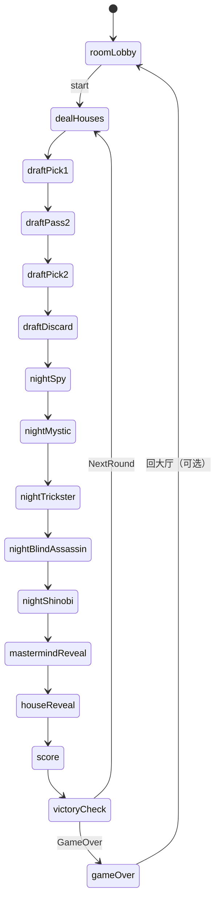
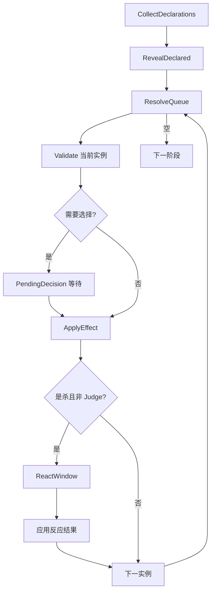

# 03 — 状态机

status: frozen-for-implementation-v0  
updated: 2026-09-16  
阶段: 1  
关联: `docs/01_GAME_RULES.md` · `docs/02_ARCHITECTURE.md` · `src/shared/types.ts`

---

## 0. 原则

- 状态机是**权威流程**的唯一描述；UI 只读 `PlayerView`。  
- 每条转移标明：**谁可操作 | 允许指令 | 推进条件 | 超时默认 | 非法示例**。  
- **ResolveQueue + PendingDecision + ReactWindow** 在阶段 2 必须存在；阶段 3 只增牌不重构。  
- 超时 60s 与 `room.forceAdvance` 自**阶段 4** 生效；阶段 2–3 本地调试可手动推进。  

### 0.1 目标校验（对应 01 §0.1 裁定）

`validateTarget(state, actor, card, target)` 在阶段 2 实现：

| 规则 | 实现 |
|---|---|
| spy / mystic 自选 | Reject `illegalTarget` |
| spy / mystic → 死亡者 | 允许 |
| blind_assassin 自选 | 允许（自杀） |
| blind_assassin → 死亡者 | Reject `illegalTarget` |
| shinobi 自选 | 允许 |
| shinobi → 死亡者 | 允许查看；不可杀 |
| 身份结算 | 始终用**当前** HOUSE（`seat.house`） |
| knownHouses | 追加快照，不回写 seat.house |

### 0.2 阶段 3 结算扩展

| 项 | 规则 |
|---|---|
| 排序 | `(编号, 座位序, cardInstanceId)` |
| 死者队列 | 结算前发动者死亡 → 出队作废 |
| ReactWindow | 仅 BA/Shinobi 选杀；裁判无 |
| 同开 Mirror+Martyr | 自己死+凶手死+自己得 1 枚；先反杀后得令牌 |
| 反应嵌套 | 最深一层 |
| Mastermind | 夜晚结束存活者持有则本方获胜；浪人则无阵营胜 |
| 掘墓 | 仅 draftDiscard；立即/预留两路径；过去阶段可立即打出【网页版】 |
| 商人 | 先二选一 view_honor / view_house，再可选交换【官方】 |

---

## 1. 主路径状态机



阶段名与 `GamePhase` 类型一一对应。

---

## 2. 夜晚阶段内部子流程

每个 `night*` 阶段相同骨架：

```
CollectDeclarations
  → (全员完成 / 超时自动 pass)
RevealDeclared
  → 公开本阶段全部已声明牌
  → 按 number 升序；同 number 按座位序【网页版】
ResolveQueue
  for each card:
    Validate  // 仍存活？仍是该实例？阶段仍匹配？
    → 若需选择：挂起 PendingDecision（chooseTarget / chooseOptional）
    → 若攻击命中：ReactWindow（Mirror/Martyr）// Judge 跳过
    → ApplyEffect → GameEvent（按可见性）
    → 离场 spent
  队列空 → 下一 Night Phase
```



### 2.1 CollectDeclarations

| 项 | 内容 |
|---|---|
| 谁可操作 | 每个**存活且仍有本阶段牌**的座位；可选择跳过者亦参与 |
| 允许指令 | `night.declare`（0..n 张本阶段牌实例）· `night.passPhase` |
| 推进条件 | 所有应答座位完成声明或 pass；或死亡/断线座位触发超时默认 |
| 超时默认【网页版】 | 60s → `passPhase` |
| 非法示例 | 声明非本阶段牌；声明已弃/已出牌；死亡后 declare；重复 commandId |

### 2.2 RevealDeclared

| 项 | 内容 |
|---|---|
| 谁可操作 | 无（自动） |
| 允许指令 | 无 |
| 推进条件 | 生成公开事件 `night.cardsDeclared`；若队列空直接跳下一阶段 |
| 超时默认 | — |
| 非法示例 | 客户端试图「撤回」已公开牌 |

### 2.3 ResolveQueue

| 项 | 内容 |
|---|---|
| 谁可操作 | core 自动；或当前 `PendingDecision.seatId` |
| 允许指令 | `night.chooseTarget` · `night.chooseOptional` · `react.decide` · 房主 `room.forceAdvance` |
| 推进条件 | 当前实例效果与可选反应全部完成 → 弹出实例 |
| 超时默认【网页版】 | 60s：target→合法默认或放弃；react→decline；optional→放弃 |
| 非法示例 | 窗口结束后补交 chooseTarget；非法 targetSeatId；非许可座位提交 |

### 2.4 ReactWindow（嵌套）

| 项 | 内容 |
|---|---|
| 触发 | BA/Shinobi 成功选杀目标；目标存活且攻击方未死 |
| 谁可操作 | **被杀座位**（1 人） |
| 允许指令 | `react.decide { react: true|false }`；若持多张反应【待确认】默认仅允许 1 张且 Mirror 优先 |
| 推进条件 | 放弃 / 成功 / 超时；Judge 攻击**无此窗** |
| 非法示例 | 攻击者提交 react；无反应牌者提交 react=true |
| 可见性 | 公共仅「有反应窗口」；持牌者不公开 |

---

## 3. 各状态一张表

### 3.1 房间与选牌

| 状态 | 谁可操作 | 允许指令 | 推进条件 | 超时默认 | 非法操作示例 |
|---|---|---|---|---|---|
| roomLobby | 房主/座位 | room.join/ready/unready/start/leave/chat | 房主 start 且 4–11 人全员 ready | — | 非房主 start；人数&lt;4 或 &gt;11；局中 join |
| dealHouses | 自动 | — | 阵营发完进入 draftPick1 | — | 客户端写状态 |
| draftPick1 | 各座位 | draft.pick | 全员完成 1 次 pick | 阶段4：60s 自动 pick 首项 | 选他人候选；非本窗口 |
| draftPass2 | 自动 | — | 传完进入 draftPick2 | — | — |
| draftPick2 | 各座位 | draft.pick | 全员完成 | 同 draftPick1 | 同左 |
| draftDiscard | 各座位 | draft.discard | 全员弃 1 张进入 nightSpy | 同 draftPick1 | 弃不在手牌；弃 0/2 张 |

### 3.2 夜晚五阶段

| 状态 | 谁可操作 | 允许指令 | 推进条件 | 超时默认 | 非法操作示例 |
|---|---|---|---|---|---|
| nightSpy | 存活座位 | declare/pass/choose* | 队列空 | pass | 宣布 Mystic 牌 |
| nightMystic | 同上 | 同上 | 同上 | pass | 重复选目标 |
| nightTrickster | 同上 | 同上 | 同上 | pass | 无弃牌时 Grave 选牌 |
| nightBlindAssassin | 同上 | 同上 | 同上 | pass | 死亡后声明 |
| nightShinobi | 同上 | 同上 | 同上 | pass | 改已揭示效果结果 |

### 3.3 收尾

| 状态 | 谁可操作 | 允许指令 | 推进条件 | 超时默认 | 非法操作示例 |
|---|---|---|---|---|---|
| mastermindReveal | 自动+可翻开者 | — | 无存活 Mastermind 则直接过 | — | 死亡仍翻 Mastermind |
| houseReveal | 存活者自动亮 | — | 全员处理完 | — | 试图不亮 |
| score | 自动 | — | 按阵营/浪人/平局发令牌 | — | 客户端指定面值 |
| victoryCheck | 自动 | — | 检查 ≥10 → gameOver；否则 dealHouses | — | 循环外结束 |
| gameOver | 房主可选 | room 重开（后置） | — | — | 继续 play 类指令 |

---

## 4. ResolveQueue / PendingDecision / ReactWindow 语义

### 4.1 为什么必须在阶段 2 落地

1. **隐藏信息与窗口绑定**：目标、可选放弃、反应都依赖「当前结算到哪张实例」；无队列会把效果糊成全局一步。  
2. **可暂停可恢复**：等待目标时状态必须可序列化进 `PendingDecision`，避免半修改状态。  
3. **单机/联机同一路径**：LocalAdapter 与 Socket 都向 core 交 `Command`，不复制判定。  
4. **阶段 3 只加注册表**：每张牌 = 「校验 + 决策序列 + 应用」三元组挂进队列类型；不改主循环。  

### 4.2 数据语义（描述级）

| 概念 | 语义 |
|---|---|
| ResolveQueue | FIFO/有序：当前 phase 已揭示实例列表 + 当前指针 |
| PendingDecision | 当前唯一活跃（或同窗集合）待决；含 windowId、合法选项、超时默认 |
| ReactWindow | 挂在「致死意图」上的特殊 PendingDecision；成功则改写死亡归属 |
| Command 重入 | 每次应用前重新校验存活与持有关系 |

### 4.3 Spy 最小闭环（阶段 2 验收剧本）

1. Collect：座位 A `declare [spy#2]`，其余 pass  
2. Reveal：公共「A 打出密探 2」  
3. Resolve：A 收到 PendingDecision.chooseTarget（合法=其他存活座位）  
4. A `chooseTarget B`  
5. 私有事件：A 查看 B 的 HOUSE；写入 `knownHouseHistory` 快照  
6. 实例 spent；队列空 → nightMystic  

---

## 5. 拒绝指令判定清单

服务端在**修改状态前**全部校验；失败则整单 reject，状态不变。

| # | 条件 | reasonCode（建议） |
|---|---|---|
| 1 | `seatToken` 无权 / 座位不匹配 | `unauthorized` |
| 2 | `commandId` 在本房已处理 | `duplicate` |
| 3 | `windowId` ≠ 当前活跃窗口 | `staleWindow` |
| 4 | `phase`/`step` 不允许该 type | `phaseMismatch` |
| 5 | 死亡座位出牌 / 选目标响应 | `notAlive` |
| 6 | 非当前 PendingDecision.seatId | `notYourTurn` |
| 7 | 目标不在 legalOptions / 自选等 TBD | `illegalTarget` |
| 8 | 非房主 start / forceAdvance | `unauthorized` |
| 9 | 对局开始后 join 未开放座位 | `gameStarted` |
| 10 | payload 结构非法 | `invalidPayload` |
| 11 | 聊天超长 / 频率 | `rateLimited` |
| 12 | 房间不存在 / 已满 | `roomNotFound` / `roomFull` |

【网页版】并行 draft：每人独立窗口；**不因**他人完成导致他人 `windowId` 失效。

---

## 6. 跨轮状态

| 状态 | 跨轮？ |
|---|---|
| 座位、昵称、连接、房主 | 是 |
| 阵营身份 | 否（每轮重发） |
| 手牌忍者牌 | 否（每轮重 draft） |
| 死亡标记 | 否（每轮全员复活） |
| 荣誉令牌（实例与枚数） | **是** |
| knownHouseHistory | 建议**跨轮保留**（记忆）；【网页版】 |
| 公共/私人事件日志 | 建议保留本局累计 |
| undrawn/hands 等牌区 | 每轮重置 |

---

## 7. 变更记录

- 2026-09-16：阶段 1 完整状态机、子流程、拒绝清单、阶段 2 架构约束。
