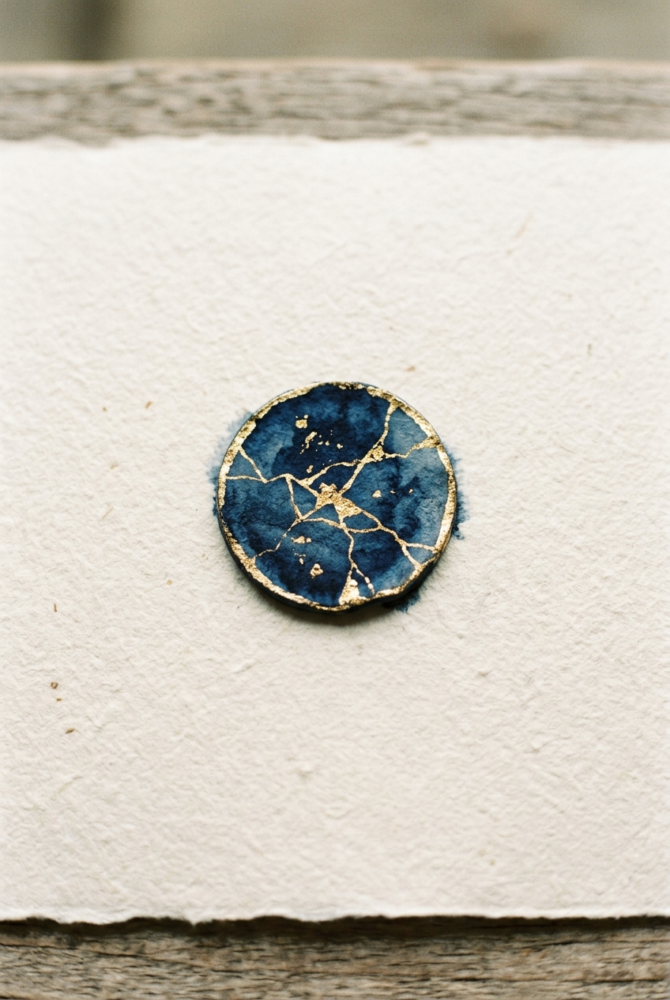

# 06 — 美术资产管线（Art Pipeline）

status: draft-for-stage-6A  
updated: 2026-09-17  
实现阶段：6A  

---

## 视觉单元策略（Visual Unit Strategy）

### 1. 为什么同效果牌共用视觉单元

在官方规则 44 张卡牌（33 张忍者牌 + 11 张阵营牌）中：
- `spy 1–6`、`mystic 1–6`、`blind_assassin 1–6`、`shinobi 1–6` 效果完全相同，编号仅决定该阶段内的结算先后顺序；
- `crane 1–5`、`lotus 1–5` 归属同一阵营，位阶仅在亮身份时用于内部判定。

若为同名牌生成完全不同的 6 张画面，不仅极大增加生图与审校成本，还会破坏玩家在快速轮抽与打出时的视觉一致性认知。因此，我们将 44 张牌收敛抽象为 **16 个卡牌视觉单元**，编号与位阶数字交由 UI 层在卡牌预留的纯色边距区域动态叠加渲染。

### 2. VISUAL_MAP 映射全表

| 视觉单元 (visualId) | 类别 | 中文名 | 覆盖的卡牌 (cardIds) | 覆盖张数 |
|:---|:---:|:---|:---|:---:|
| `spy` | ninja | 密探 | `spy-1` ~ `spy-6` (`spy:1` ~ `spy:6`) | 6 |
| `mystic` | ninja | 隐士 | `mystic-1` ~ `mystic-6` (`mystic:1` ~ `mystic:6`) | 6 |
| `shapeshifter` | ninja | 百变者 | `shapeshifter` (`shapeshifter:1`) | 1 |
| `grave_digger` | ninja | 掘墓人 | `grave_digger` (`grave_digger:2`) | 1 |
| `troublemaker` | ninja | 捣蛋鬼 | `troublemaker` (`troublemaker:3`) | 1 |
| `spirit_merchant` | ninja | 商人 | `spirit_merchant` (`spirit_merchant:4`) | 1 |
| `thief` | ninja | 盗贼 | `thief` (`thief:5`) | 1 |
| `judge` | ninja | 裁判 | `judge` (`judge:6`) | 1 |
| `blind_assassin` | ninja | 刺客 | `blind_assassin-1` ~ `blind_assassin-6` (`blind_assassin:1` ~ `blind_assassin:6`) | 6 |
| `shinobi` | ninja | 上忍 | `shinobi-1` ~ `shinobi-6` (`shinobi:1` ~ `shinobi:6`) | 6 |
| `mirror_monk` | ninja | 还施者 | `mirror_monk` | 1 |
| `martyr` | ninja | 殉道者 | `martyr` | 1 |
| `mastermind` | ninja | 大将军 | `mastermind` | 1 |
| `crane` | house | 仙鹤 | `crane-1` ~ `crane-5` (`crane:1` ~ `crane:5`) | 5 |
| `lotus` | house | 莲花 | `lotus-1` ~ `lotus-5` (`lotus:1` ~ `lotus:5`) | 5 |
| `ronin` | house | 浪人 | `ronin` | 1 |
| **小计** | - | - | **16 个卡牌视觉单元** | **44 张牌** |

另有 3 个 UI 视觉单元槽位：
- `ui-lobby-bg`：大厅背景底图
- `ui-table-texture`：牌桌和纸底纹
- `ui-button-primary`：主要按钮质感板

### 3. 编号动态渲染与未来扩展

- **动态叠加**：卡面顶部保留 12%、底部保留 22% 纯色/渐变空白区域。卡牌编号（如 `1` ~ `6`）、卡名及效果说明全部由前端 UI 层（6B/6C）渲染在安全区内，画面中不包含固化的硬编码数字。
- **平滑升级**：未来若需为每张牌定制独一无二的专属差分立绘，只需将 `VISUAL_MAP` 拆分为 `spy-1` .. `spy-6`，补充对应 prompt 并生成新图即可，权威规则与状态机完全无需任何改动。

### 4. 6B 批量生成工作量优化

- 原计划：44 张卡牌 + 3 条 UI = 47 张
- **现方案：16 个卡牌视觉单元 + 3 条 UI = 19 张**
- **实际工作量下降 60%+**，大幅降低人工投喂与多轮校对的疲劳度，大幅提升风格收敛性。

---

## 统一风格 Baseline

所有视觉单元及衍生美术资产统一遵循以下视觉基线：

### 风格前缀（所有卡面共用）

> Modern ukiyo-e character illustration as the main subject, ink wash painting (sumi-e) background depicting night atmosphere, with minimal neon accents or gold foil (kintsugi) highlights on key skill elements and faction crests. Palette: ink black and deep indigo for base, with restrained neon/gold accents. Top 12% and bottom 22% of the composition reserved as plain color margins for text overlay, no visual elements in those regions. Original artwork, not imitating any existing published illustration.

### 阵营配色（Faction Palette）

- **莲花 Lotus**：青金（deep lapis lazuli blue）+ 银白点缀
- **仙鹤 Crane**：朱红（vermilion red）+ 金箔点缀
- **浪人 Ronin**：灰白（ash grey / off-white），无点缀

### 构图与留白约定

- 画幅比例：`2:3` 纵向竖版卡牌构图。
- 顶部保留 12%、底部保留 22% 的纯色/水墨渐变空白区域，作为卡名、效果文案与数值的叠加安全区，禁止出现主体与复杂视觉元素。
- 负面提示词（统一）：`text, watermark, logo, typography, border, frame, extra limbs, low quality, blurry, deformed hands, signature, cropped`

---

## 一、生图工具链

生图工具由用户在本地实测验证确定：

- **生图工具**：Antigravity CLI 1.2.4，agent 模式。
- **调用方式**：在 agy 的 TUI（终端用户界面）中，使用自然语言指示 agent 调用内置的 `generate_image` 工具。**不使用** `agy -p` CLI 参数模式。
- **已实测结论**：
  1. agy agent 能够精准理解自然语言描述并触发内部 `generate_image` 工具调用。
  2. 输出格式：`jpg`。
  3. 输出路径：`~/.gemini/antigravity-cli/brain/{uuid}/{filename}.jpg`（uuid 目录每次不同，filename 含时间戳不可预测）。
  4. 一张图一次调用，agent 产出时通常附带简短的视觉说明（风格/配色/比例）。
- **本项目定位**：不编写自动生图脚本。6B 的批量生成采用「人工驱动 agy agent」方式。6A 产出完整的 prompts 数据与工作流文档，使操作者能直接按文档逐条投喂给 agy。

---

## 二、One-Shot 风格锚点

用户已在本地通过 Antigravity CLI 生成一张「荣誉标记（Honor Token）」实物概念图，作为整个《忍者之夜》美术资产管线的终极视觉锚点：



### Prompt 原文（一字不改记录）

```text
A small circular token, ink dot base with gold foil flecks (kintsugi style), minimal design, deep indigo and gold on off-white paper texture, 2:3 aspect ratio
```

### 生成结果视觉描述

> Vertical 2:3 composition. A single circular token rests centered on textured off-white washi paper with visible deckled edges, shot top-down. The token is a deep indigo ink-wash disc with irregular gold foil cracks radiating from its center (kintsugi style) and a thin gold-foil rim. The paper sits on a weathered wooden surface visible at the top and bottom edges of the frame. Lighting is soft and natural, revealing paper fibers and the metallic sheen of the gold. Minimalist composition with generous negative space; no text, no watermark.

### 用途说明

1. **6B 生成基准**：在 6B 生成其余卡面时，本图作为唯一风格参照基准。生成第 1 张（如 `spy`）必须先与此图对比质感、光影与和纸留白，风格一致方可继续。
2. **直接复用为最终素材**：6B 启动后，此图可直接复制为 `public/assets/tokens/honor-token.jpg` 作为荣誉令牌的实际游戏素材，无需重新生成。
3. **可复现性**：若后续需要增补或重新生成令牌，仅需保持上述同一 prompt 即可。

---

## 三、6B 批量生成工作流（操作手册）

6B 启动时，由人工按以下六步标准化流程执行：

1. **导出 prompt 任务清单**：
   ```powershell
   npm run gen:preview > .work/prompts.md
   ```
2. **逐条投喂 agy agent**：
   在 Antigravity TUI 对话中，将对应视觉单元的 `promptEn` 复制给 agent，指示其调用 `generate_image`。
3. **素材提取与归档**：
   生成完成后，从 agent 回显的 `~/.gemini/antigravity-cli/brain/{uuid}/{filename}.jpg` 路径提取图片，复制并重命名为：
   - 卡牌素材：`public/assets/cards/{visualId}.jpg`（如 `public/assets/cards/spy.jpg`）
   - UI 素材：`public/assets/ui/{visualId}.jpg`
4. **小步试跑与对照**：
   首批只跑 3 个典型视觉单元：
   - `spy`（暗部水墨与金箔眼）
   - `shapeshifter`（面具与双影霓虹）
   - `mastermind`（高台棋局与大景深）
   与 `docs/06_assets/one-shot-kintsugi-token.jpg` 对比，确认水墨质感、和纸留白、金箔光泽统一后，再推进剩余 13 个卡牌视觉单元与 3 个 UI 素材。
5. **资产清单登记**：
   每张图落盘后，在 `manifest.json` 中追加一条记录：
   ```json
   {
     "visualId": "spy",
     "file": "public/assets/cards/spy.jpg",
     "sourcePath": "C:/Users/.../brain/.../spy_12345.jpg",
     "generatedAt": "2026-09-17T00:00:00Z",
     "note": "one-shot matched"
   }
   ```
   （允许手工维护，无需额外脚本）
6. **柔性批次与重试**：
   不要求单次全量生成；允许随时中断、分批推进；单张瑕疵可直接复制该项 `promptEn` 重新让 agent 生成覆盖。

---

## 四、不做事项（本阶段硬约定）

1. 不修改 core 里的权威牌组定义。
2. 不在 6A 修改 UI 层逻辑（6B 才接入素材展示）。
3. 不调用任何外部未受控生图 API。
4. 不在 6A 阶段生成任何图片文件（除用户已手工放置的 One-Shot 图外）。
5. 不做运行时动态生图。
6. 不在 6A 引入 `sharp`（6B 处理缩放裁剪时再安装）。
7. 不引入额外的生图 SDK 依赖。
